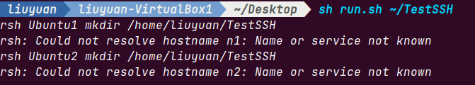
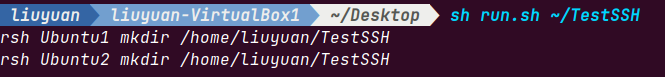
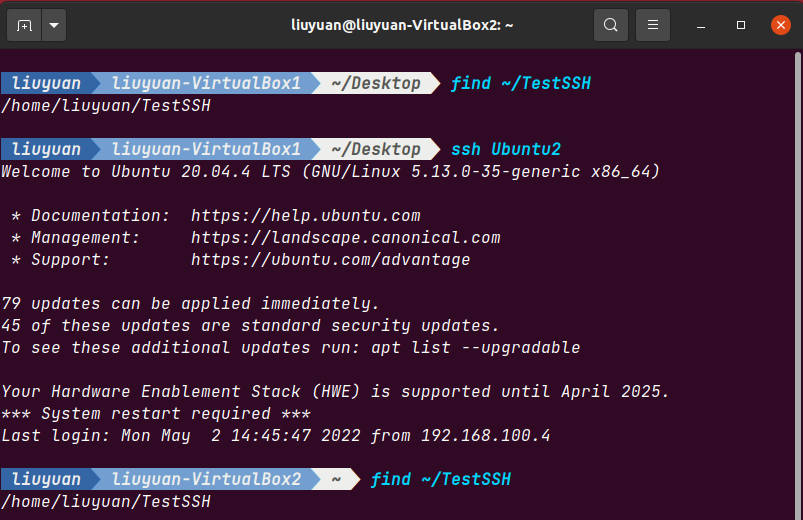

# Structure of Computer System

> 大二春季学期
>
> Spring Semester of sophomore year

## Lab1

> 用VirtualBox创建两个虚拟机，并使用SSH无密码访问彼此和自身
>
> Using VirtualBox to create two virtual machines and use SSH to visit each other and one-self without password

### Reference

1. [How to Make Virtual Machines Talk to Each Other in VirtualBox](https://www.youtube.com/watch?v=vReAkOq-59I)

### Notes

1. Check own IP: `ipconfig`
2. Generate own SSH key: `ssh-keygen -t rsa`
3. Copy the public SSH key to another virtual machine so that we can visit it without password: `ssh-copy-id <User>@<ip>`
4. Create nickname for virtual machines:
   ```bash
   Host <HostNickName>
   HostName <HostIP>
   User <UsernameOnHost>
   IdentitiesOnly YES
   ```

## Lab2

> OpenMP Programming

### 2.1

> Compilation and running of OpenMP program

#### Reference 

1. [How to install and run openmp under ubuntu 18 with example](https://www.youtube.com/watch?v=5cVU4MKsvqU)

#### Notes

1. OpenMP grammer
	1. [#pragma omp parallel](https://www.ibm.com/docs/en/zos/2.2.0?topic=SSLTBW_2.2.0/com.ibm.zos.v2r2.cbclx01/prag_omp_parallel.htm)
2. Compile Option
	1. GNU Compiler
		`g++ -fopenmp -O2 -o ...`

		1. [gcc -O0 -O1 -O2 -O3 四级优化选项及每级分别做什么优化](https://blog.csdn.net/qq_31108501/article/details/51842166#:~:text=%2DO2%EF%BC%9A%20%E6%98%AF%E6%AF%94O1%E6%9B%B4,%E7%94%9F%E6%88%90%E4%BB%A3%E7%A0%81%E7%9A%84%E6%89%A7%E8%A1%8C%E6%95%88%E7%8E%87%E3%80%82)
		2. [GNU: 3.10 Options That Control Optimization](https://gcc.gnu.org/onlinedocs/gcc-3.4.6/gcc/Optimize-Options.html#Optimize-Options)

	2. VS Compiler
		
		View notes [here](./2_Lib2/2.1/Q1.cpp)

### 2.2

I splited the code from laboratory manual into [method1](./2_Lib2/2.2/method1.cpp) and [method2](./2_Lib2/2.2/method2.cpp), to use them to see the change of the result as the length of the matrix increases, please use `sh run_1.sh` and `sh run_2.sh` at [the directory](./2_Lib2/2.2). To visualize the difference between the two methods, take a look [here](./2_Lib2/2.2/result.xls)

******

***Idea of Exercise***

To avoid thread collisions that I can't deal with now, I choose to make each thread to handle one row to finishe this task. 

To view all results, check [here](./2_Lib2/2.2/practice)

## Lab3

1.	https://www.open-mpi.org/software/ompi/v1.6)

### 3.1

#### Reference

1.	[Download OpenMPI 1.6.5](

#### Notes

1. Unzip the zip file *openmpi-1.6.5.tar.gz* with command `tar -xzvf openmpi-1.6.5.tar.gz` at directory `~/.local/share/applications`
2. Get into the directory, `./configure --prefix=~/.local/share/applications/openmpi-1.6.5 >& configure.log`
3. `make >& make.log`
4. `make install`
    At this step, may counter:
    +	`make *** no tragets specified and no makefile found. stop`
    +	`no rule to make target 'install'`
    After read `README`, we can find `Building Open MPI` at Line 584(with `/make` in vim). Use command at Line 1133:
    ```shell
    make all
    sudo make install
    ```
    Just solve the problem.
5. Test necessary applications: 
    ```shell
    cd examples
    make all
    ```
    For I've gotten all necessary applications, nothing more to do here.
6. Use SSH to login other VMs, done in previous libs.

### 3.2

#### Notes

1.	Create directories in remote VMs:

	***run.sh***
	```shell
	# Check if there is a parameter exit
	if [ -z $1 ]
	then
		echo "$0 < subdirname >"
		echo "(e.g.) $0 ZSMPI"
		exit
	fi;
	
	# For me, my VMs' names are: Ubuntu1, Ubuntu2
	# So the scipt is:
	for m in 1 2
	do
		echo "rsh Ubuntu$m mkdir $1"
		rsh Ubuntu$m mkdir $1
	done
	```
	
	Run file: `sh run.sh ~/TestSSH`, if the names of the VMs are wrong, failure messages are like:

	

	Correct result:
	
	
	
	


